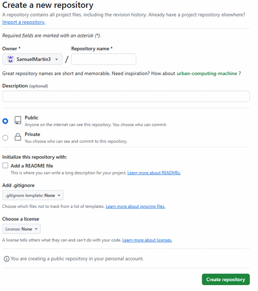
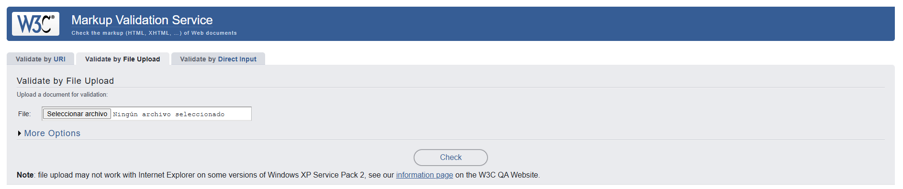
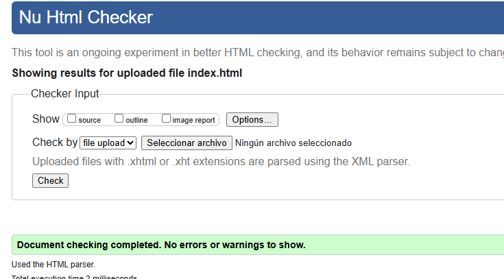

# Github

Esta es una documentacion basica sobre Github.

Github es un sistema de control de versiones, que nos ayuda a llevar un orden completo de las modificaciones y avances de un trabajo. Sirve para poder trabajar un proyecto en diferentes ordenadores y poder acceder a lo que has hecho anteriormente con muchas más opciones.

En Github podemos hacer muchas cosas pero las más significativas y importantes son las siguientes:

- Podemos hacer que podamos tirar hacia atrás en un trabajo subiendo commits por si ocurre algún problema y no sabemos qué hacer volvemos a como lo teníamos antes.
- Trabaja con ramas para poder editar cosas sin tener que tocar el trabajo principal.
- Se pueden crear clones de los repositorios para poder hacer trabajo simultáneo en diferentes ordenadores y después juntarlo todo.
- Puedes trabajar sin conexión a la red.
- Trabaja con plataformas de desarrollo colaborativo para poder tener los repositorios en la nube.
- Una vez instalado Github tendremos que configurar nuestro nombre de usuario y email con estos comandos en la consola.

git config--global user.name “Tu nombre”
git config--global user.email tugmail@gmail.com
Para crear un repositorio solo tendremos que darle al botón de "Nuevo" en "Crear un nuevo repositorio".



Una vez tenemos el repositorio creado tenemos que clonarlo en nuestra máquina local para poder trabajar y después subirlo a Github para hacer las pruebas fuera por si ocurre algo. Primero de todo tendremos que copiar la URL del repositorio.


Y después en nuestra consola en la raíz del repositorio tendremos que poner los siguientes comandos

1. -git clone URL del repositorio
2. -git init (para iniciarlo)
3. -git add “archivo” o git add . (para subir el archivo o todo)
4. -git commit-m “nombre del commit” (para saber que hemos subido por si tenemos que ir hacía atrás saber que es lo último que hemos hecho)
5. -git push origin main (para subirlo a la rama principal del repositorio)

Todo esto si ya tenemos el repositorio inicializado por el README si no hemos marcado esta opción tendremos que poner antes de lo anterior estos comandos

1. -git init
2. -git add README.md (para iniciar el repositorio en el local)
3. -git branch-M main (para asociarlo a una rama)-git commit-m "first commit”
4. -git remote add origin https://github.com/TuNombre/Prueba.git. (para asociar el local con el remoto)
5. -git push-u origin main

Y para sincronizarlo tendremos que poner los comandos de diferente forma git init

1. -git remote add origin https://github.com/TuNombre/Prueba.git.
2. -git branch-M main-git add .
3. -git commit-m "first commit"
4. -git push-u origin

Y por último para importar un repositorio ya creado solo tenemos que copiar la URL y a la hora de crear el nuevo repositorio nos dará la opción de importar un repositorio y tendremos que copiar la URL allí.


Si queremos utilizar Github Pages tendremos que ir al repositorio y en sus opciones de ajustes tendremos que ir al apartado de Pages y poner la rama principal y la carpeta root cuando hayamos hecho eso nos saldrá la URL del Pages y ya. Es muy importante que tengamos el index.html para que lo reconozca y podamos acceder


# Markdown

Markdown es un lenguaje de marcas usado por Github.

Tenemos etiquetas básicas para hacer según qué cosas como encabezados diferentes, estilos de letras, listas y más pero ahora veremos las más utilizadas y básicas.

Los encabezados se hacen con la etiqueta # y cuantas más almhodillas le pones más pequeño será.
# H1
## H2
### H3
#### H4
##### H5
###### H6

Los estilos de letra que podemos utilizar son los siguientes:
- Para poner letra en itálica o cursiva tendremos que poner el texto entre asterisco o entre barras bajas.
*texto* o _texto_
- Para ponerlo en negrita tendremos que hacer lo mismo pero en vez de poner uno pondremos dos.
** texto ** o __ texto __
- Para tachar el texto lo pondremos entre ~
~texto~
- También podemos hacer listas ordenadas y desordenadas
Para hacer una lista ordenada solo tendremos que poner un numero delante
1.Primer cosa
2.Segunda cosa
3.Tercer cosa
- Y para hacerla desordenada solo tendremos que poner uno de los siguientes símbolos
/*/-/+/
● Cosa
-Cosa
+Cosa
- Para crear párrafos tendremos que introducir lineas en blanco entre el texto
  
texto
  
- El código se ha de incluir entre acentos graves (`). Si en el código aparece un acento grave, se ha de introducir el carácter dos veces al principio de la sección del código.
``Todo esto es `código`.``
- También se puede marcar el área correspondiente al código insertando tres acentos graves al principio y al final. Junto a los tres iniciales se puede indicar el lenguaje (HTML, JavaScript) para que incluso se muestre con los colores adecuados:
```html
<html>
<head>
</head>
</html>
```
- Para poder hacer links tendremos que poner entre corchetes el nombre del link y después el link entre paréntesis.
[Texto del link]0(https://ejemplo.com/ "Título opcional del enlace")

- Para introducir imágenes se puede hacer de dos formas diferentes

1. Desde una URL


2. Desde un archivo


- Para hacer una tabla y configurarla tendremos que hacer esto y podemos hacer esto.
a. Los dos puntos se usan para alinear las columnas (izquierda , derecha o centrado).
b. No es necesario que estén alineadas verticalmente. Solo a nivel visual para claridad del código.
c. Se han de poner al menos tres guiones para separar cada encabezado.

| Tables        | Are           | Cool  |
| ------------- |:-------------:| -----:|
| col 3 is      | right-aligned | $1600 |
| col 2 is      | centered      |   $12 |
| zebra stripes | are neat      |    $1 |

- Para poner una nota al pie de la página tendremos que poner entre corchetes un cono y un 1.
Texto con enlace al pie de página [^1]

- Y por último para hacer listas de verificación tendremos que dejar un espacio en blanco entre los corchetes que no estén marcadas
A-[x]
B-[ ]
C-[ ]


# HTML

HTML es un lenguaje de marcas para hacer páginas web en navegadores y actualmente el más utilizado. Las normas de este lenguaje las define el World Wide Web (W3C) y por esto todas las páginas web están hechas de forma similar.

Historia del HTML

En el año 1993 Tim Bernes-Lee describe el lenguaje HTML en un primer borrador que no se convirtió en estándar. Posteriormente, Dave Raggett propone el HTML+, que tampoco funciona bien. La IETF crea un grupo de trabajo para desarrollar un estándar basado en los borradores anteriores. Entonces surge el HTML 2.0 en 1996, el desarrollo pasa al W3C. A partir de ahí se ha ido mejorando el lenguaje hasta llegar al HTML 5 el utilizado actualmente donde nos da muchísimas más opciones.

HTML significa HyperText Markup Language

HyperText es el texto que enlaza con otros recursos como la base de la web donde se realiza.
Markup son las etiquetas que estructuran y dan forma a la página web.
Language es el lenguaje con reglas y estructuras.
En este lenguaje de marcas hay muchas opciones para poder hacer tu página web mejor y ordenada a forma de programación. Para poder realizar todo esto tendremos que saber las etiquetas básicas y sus funciones.

Para empezar una página web hay una etiqueta que define en que html queremos empezar a escribir donde te da cierta información importante como el idioma predeterminado, el título y más cosas.

Ahora veremos un ejemplo de código HTML y lo que hace cada etiqueta que contiene.

<!DOCTYPE html> Aquí nos dice el tipo de documento que es.
<html lang="es"> Aquí podemos ver el idioma y la etiqueta de HTML se abre con todo lo que contendrá la página.
<head> Aquí se encuentra lo que no se verá en la página web pero está configurado y información adicional.
<meta charset="UTF-8"> Aquí podemos ver los caracteres que utilizará.
<meta name="viewport" content="width=device-width, initial-scale=1.0">Información adicional
<title>Primera Página ASIX </title> Aquí podemos ver el título de la página.
</head>

Como podemos ver las etiquetas siempre se abren y se cierran con <etiqueta> Texto </etiqueta>
También se puede observar que dentro de las etiquetas podemos poner atributos para que hagan cosas más concretas y fáciles de entender.
<etiqueta> atributo Texto </etiqueta>
También existen etiquetas sin contenido como una imagen y se les llama elementos vacíos o al contrario si tienen más de un elemento juntos se les llama anidamiento.

Aqui tenemos otro ejemplo donde hay muchas más etiqueta muy utilizadas
<body> Esta etiqueta encierra todo el contenido que mostrará la página web
<h1>Primer Título </h1> En esta etiqueta se muestra el titulo del articulo que va abajo y el número indica la grandaria e importancia.
<hr> Esta etiqueta mete una línea horizontal para separar información.
<h2>Índice de contenidos</h2> Una etiqueta igual pero con el título menor
<!--ol y li es una lista ordenada--> Esta etiqueta es un comentario que sirve para guiar al programador para saber la estructura, no sale en la página web.
<ol> Esta etiqueta hace una lista ordenada
<li>Introducción </li> Y esta etiqueta ordena la lista por números
<li>Quienes somos</li>
<ul>Software</ul> Esta etiqueta hace una lista desordenada
<ul>Hardware</ul>
<li>Nuestras listas de negocios</li>
</ol>
<ul>
<li>Intro</li>
<li>Quienes somos</li>
<li>Nuestra lista</li>
</ul>
<p> Esta etiqueta hace un párrafo y lo mueve a una línea nueva y ocupa todo el ancho de la página
<strong>Lorem ipsum</strong> Esta etiqueta resalta la letra en negrita.
dolor sit, amet consectetur adipiscing elit. <span>Optio, quas! Quas, omnis vel quaerat eum dolorem fugit ab inventore veritatis</span> Esta etiqueta sirve para seleccionar un trozo de texto, quia cupiditate
recusandae ipsum eos ipsam quibusdam repudiandae, sed cumque. </p>
<br> Esta etiqueta sirve para hacer un salto de línea
<em>Lorem ipsum</em> esta etiqueta sirve para dar un énfasis
</body> Cierre de la etiqueta de body
</html> Cierre de la etiqueta de html

Las rutas se usan para enlazar archivos (como imágenes, CSS o scripts) y hay dos tipos que son las siguientes:

Relativas: dependen de la ubicación actual del archivo.
  ``````

Absolutas: incluyen toda la dirección desde el servidor.

``````

Una herramienta muy útil que hemos visto son los validadores de códigos HTML ya que nos permiten ver si hay algún fallo en nuestro código HTML de forma rápida y segura. Funciona de manera simple, subes tu archivo y el validador solo lo revisa y te pone los fallos y donde están.




Los formularios permiten al usuario enviar datos a una página diferente.
<form>
  <label for="nombre">Nombre:</label>
  <input type="text" id="nombre" name="nombre">
  
  <label for="email">Correo:</label>
  <input type="email" id="email" name="email">
  
  <input type="submit" value="Enviar">
</form>
Hay atributos en las etiquetas que son muy utilizados como pueden ser el for, name, value, id y más.
Suelen ser para identificar la información o darle algún trabajo.

Para hacer nuestra página web más fácil de ver y mejor distribuida hay etiquetas semánticas que se usan mucho por las razones que he dicho
<header>: cabecera de la página.
<nav>: menú de navegación.
<main>: contenido principal.
<section>: una sección del contenido.
<footer>: pie de página.

En la etiqueta de body hay dos elementos diferentes que son:
Elementos de bloques y elementos de línea.
Los elementos de bloques son grandes estructuras de etiquetas que normalmente los navegadores los muestran como bloques independientes y los separa como por ejemplos los títulos, párrafos, lista o tablas.
Y los elementos de línea son pequeñas estructuras que representan o describen pequeños trozos de texto o datos y el navegador los suele mostrar en línea uno tras otro dentro del bloque que los contiene. Son un ejemplo los hiperenlaces, las citas o las imágenes.
Ahora explicaré una etiqueta que no salen en el ejemplo.
Los enlaces son la etiqueta a a href="https://www.mozilla.org/es-AR/about/manifesto/">Manifesto Mozilla /a

Y estos son las etiquetas más utilizadas y la historia del HTML.

